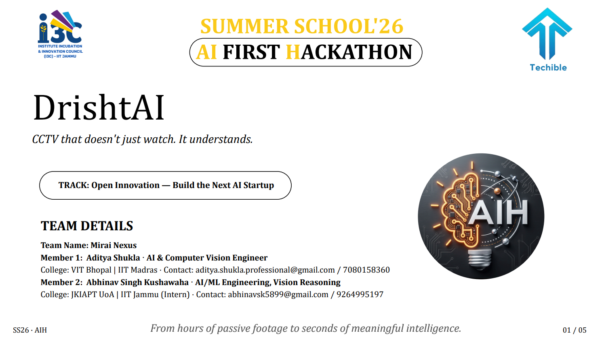
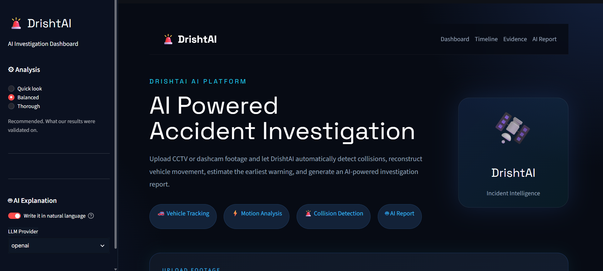
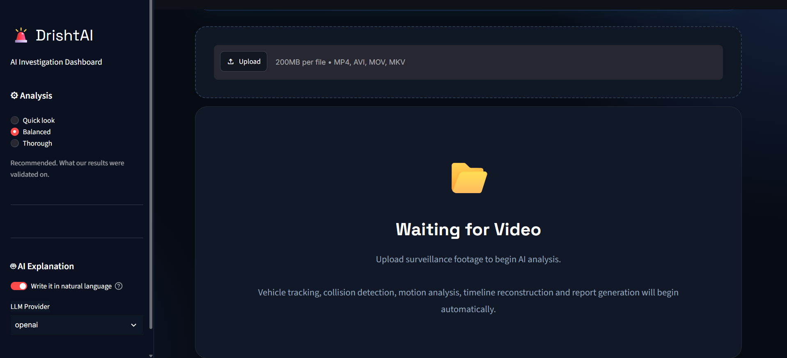
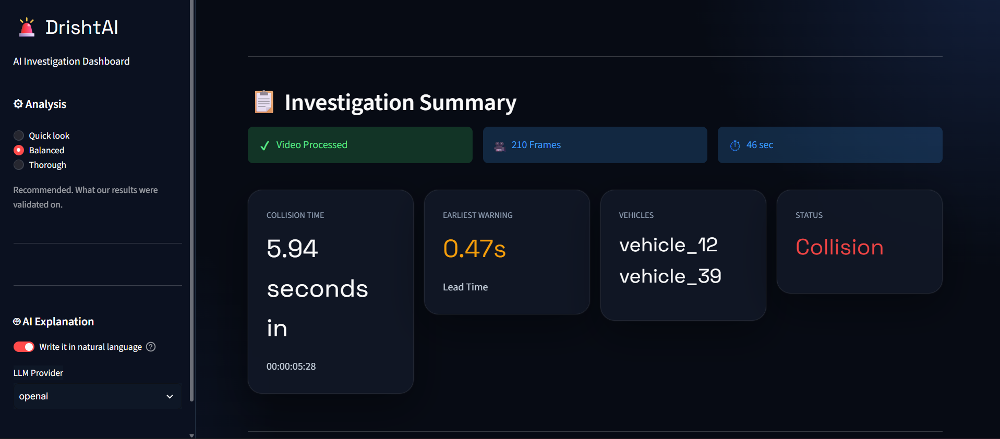
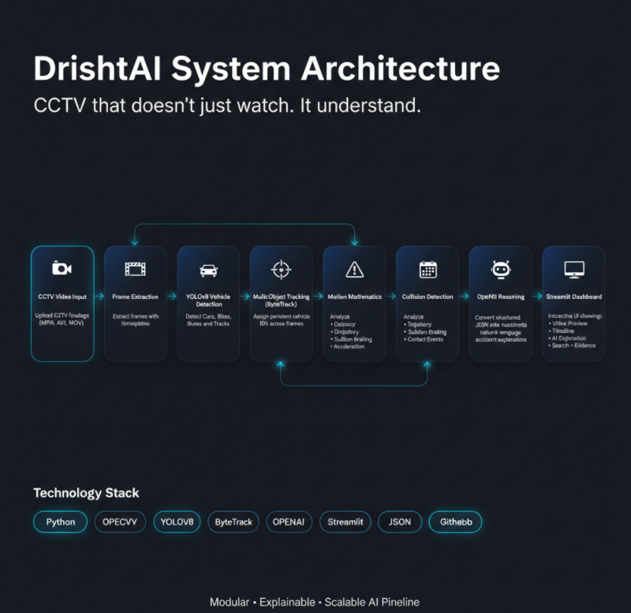
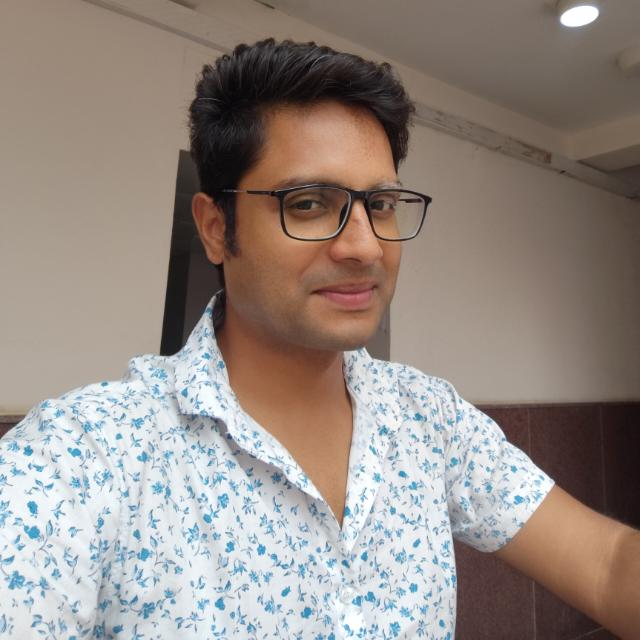

<div align="center">


# 🚨 DrishtAI

### *CCTV that doesn't just watch. It understands.*

<p>

An AI-powered Visual Intelligence System capable of understanding CCTV footage,
detecting road accidents, reconstructing event timelines,
and explaining **what happened, when it happened, and what led to it.**

</p>


<br><br>



</div>

---

# 🌟 Overview

Every day millions of CCTV cameras silently record accidents, thefts and suspicious activities.

Unfortunately...

Finding the exact moment of an accident still requires someone to manually watch hours of footage.

Traditional CCTV systems record everything.

**DrishtAI understands everything.**

Instead of merely detecting an accident after it happens, DrishtAI reconstructs the sequence of events leading to the incident and pinpoints the **earliest observable warning** that could have indicated danger.

This transforms passive surveillance into intelligent visual reasoning.

---

# 💡 The Problem

Traditional surveillance systems suffer from several limitations:

- Hours of manual footage review
- No understanding of event sequences
- Difficult incident search
- Delayed emergency response
- Human dependency
- No explanation of why incidents occurred

Imagine reviewing **12 hours** of CCTV footage to locate a collision lasting **less than 5 seconds.**

That is the problem DrishtAI solves.

---

# 🚀 Our Solution

DrishtAI combines

- Computer Vision
- Multi-Object Tracking
- Motion Mathematics
- Event Reasoning
- Timeline Generation
- Large Language Models

into one intelligent pipeline capable of transforming raw CCTV footage into understandable incident reports.

Instead of asking

> "Can you search the video?"

Users simply ask

> **"When did the accident happen?"**

or

> **"What caused the collision?"**

DrishtAI provides the answer within seconds.

---

# ✨ Core Features

<table>

<tr>

<td width="50%">

## 🚗 Intelligent Vehicle Detection

Detects

- Cars
- Trucks
- Motorcycles
- Buses

using YOLOv8.

</td>

<td width="50%">

## 🎯 Persistent Vehicle Tracking

Assigns every detected vehicle
a unique ID using ByteTrack,
allowing motion analysis across hundreds of frames.

</td>

</tr>

<tr>

<td>

## 📈 Motion Analysis

Calculates

- Velocity
- Direction
- Acceleration

for every tracked object.

</td>

<td>

## ⚠️ Collision Detection

Detects

- Distance dropping

- Trajectory intersections

- Sudden braking

- Vehicle collisions

using custom rule-based reasoning.

</td>

</tr>

<tr>

<td>

## 🧠 Event Timeline Builder

Builds a chronological sequence of every important event before, during and after an accident.

</td>

<td>

## 🤖 AI Explanation Layer

Uses OpenAI GPT-4o Mini to transform technical event data into natural language explanations.

</td>

</tr>

<tr>

<td>

## 📍 Earliest Warning Detection

Identifies the first observable moment that indicated an accident was becoming likely.

</td>

<td>

## 📊 Interactive Dashboard

Modern Streamlit dashboard for:

- Uploading videos

- Viewing timelines

- AI-generated reports

- Evidence visualization

</td>

</tr>

</table>

---

# 🎥 What DrishtAI Can Do

✅ Upload CCTV footage

↓

✅ Detect every vehicle

↓

✅ Track vehicle movement

↓

✅ Measure speed and acceleration

↓

✅ Detect abnormal behaviour

↓

✅ Identify collisions

↓

✅ Build an event timeline

↓

✅ Find the earliest warning

↓

✅ Explain the accident using AI

↓

✅ Answer user questions about the footage

---

# 🏆 Why DrishtAI?

Unlike conventional CCTV analytics systems that only answer:

> **"What happened?"**

DrishtAI goes one step further.

It answers

> **"What led to it?"**

This allows investigators, emergency responders and security personnel to understand the complete chain of events instead of isolated incidents.

---

# 📸 Project Preview

> Replace these screenshots with your own.

<p align="center">



<br><br>





</p>

---

# ⚡ Highlights

| Feature | Supported |
|----------|-----------|
| Vehicle Detection | ✅ |
| Vehicle Tracking | ✅ |
| Motion Analysis | ✅ |
| Collision Detection | ✅ |
| Event Timeline | ✅ |
| Earliest Warning Detection | ✅ |
| Natural Language Explanation | ✅ |
| Interactive Dashboard | ✅ |
| AI-powered Search | ✅ |
| OpenAI Integration | ✅ |

---

# 📂 Table of Contents

- Project Architecture
- AI Pipeline
- Technologies Used
- Folder Structure
- Installation
- Project Setup
- Running DrishtAI
- Understanding the Pipeline
- JSON Schema
- Dashboard Walkthrough
- Future Improvements
- Team
- License

---

# 🏗️ DrishtAI System Architecture

<p align="center">



</p>

DrishtAI follows a modular AI pipeline where every stage performs one dedicated responsibility before passing structured data to the next stage.

Rather than relying on a single monolithic AI model, the project combines multiple Computer Vision and AI reasoning modules, making every decision explainable, debuggable and scalable.

---

# 🔄 Complete AI Pipeline

```text

                    INPUT VIDEO
                         │
                         ▼
         ┌────────────────────────────┐
         │     Frame Extraction       │
         │   (Timestamp Generation)   │
         └────────────────────────────┘
                         │
                         ▼
         ┌────────────────────────────┐
         │      YOLOv8 Detection      │
         │ Detect Cars • Bikes • Bus  │
         │      Truck Detection       │
         └────────────────────────────┘
                         │
                         ▼
         ┌────────────────────────────┐
         │     ByteTrack Tracker      │
         │ Persistent Vehicle IDs     │
         └────────────────────────────┘
                         │
                         ▼
         ┌────────────────────────────┐
         │      Motion Analysis        │
         │ Velocity                    │
         │ Direction                   │
         │ Acceleration                │
         └────────────────────────────┘
                         │
                         ▼
         ┌────────────────────────────┐
         │   Collision Detection      │
         │ Distance Analysis          │
         │ Trajectory Intersection    │
         │ Velocity Drop Detection    │
         └────────────────────────────┘
                         │
                         ▼
         ┌────────────────────────────┐
         │    Timeline Builder        │
         │ Earliest Warning Detection │
         └────────────────────────────┘
                         │
                         ▼
         ┌────────────────────────────┐
         │ OpenAI Explanation Layer   │
         │ Human Readable Report      │
         └────────────────────────────┘
                         │
                         ▼
         ┌────────────────────────────┐
         │ Streamlit Review Console   │
         │ Timeline • Search • Report │
         └────────────────────────────┘

```

---

# 🧠 AI Pipeline Explained

Unlike traditional surveillance systems, DrishtAI separates the problem into multiple intelligent stages.

Each module specializes in one task, producing structured information that becomes the input for the following module.

This design provides:

- Better debugging
- Easier scalability
- Transparent reasoning
- Faster development
- Easier model replacement

Every stage is independently testable.

---

# 📦 Pipeline Stages

---

## 🎥 Stage 1 — Frame Extraction

The pipeline begins by extracting frames from the uploaded CCTV footage.

### Responsibilities

- Read video sequentially
- Generate accurate timestamps
- Preserve original frame index
- Maintain timing precision
- Produce metadata for downstream modules

### Output

```text
FrameRecord
├── frame_index
├── timestamp
├── time_seconds
└── image_path
```

---

## 🚗 Stage 2 — Vehicle Detection

YOLOv8 detects every road vehicle present inside each frame.

Supported classes include:

- 🚗 Car
- 🚌 Bus
- 🏍 Motorcycle
- 🚛 Truck

Each detection includes

- Bounding Box
- Confidence
- Vehicle Type
- Position
- Timestamp

No tracking IDs are generated here because detection is stateless.

---

## 🎯 Stage 3 — Multi Object Tracking

Detected vehicles are passed to ByteTrack.

ByteTrack assigns a unique ID that persists across multiple frames.

Example

```text
Vehicle_1

Frame 1

↓

Frame 2

↓

Frame 3

↓

Frame 4

↓

Frame 200

Same Object ID
```

This persistent identity allows motion calculations across time.

Without tracking, speed and trajectory cannot be calculated.

---

## 📈 Stage 4 — Motion Mathematics

This module transforms tracked positions into meaningful motion.

For every tracked vehicle it calculates:

- Velocity (px/s)
- Direction
- Acceleration

It also smooths noisy trajectories to improve collision detection reliability.

Output example

```json
{
    "object_id":"vehicle_2",
    "velocity":184.4,
    "direction":91.7,
    "acceleration":-72.6
}
```

---

## ⚠️ Stage 5 — Collision Detection

Instead of relying on deep learning alone, DrishtAI uses explainable reasoning rules.

It evaluates

✔ Bounding-box distance

✔ Trajectory intersection

✔ Relative speed

✔ Sudden braking

✔ Sustained velocity changes

✔ Contact windows

Detected events include

```
moving_normally

↓

distance_dropping

↓

trajectory_intersecting

↓

sudden_velocity_change

↓

collision
```

---

## 🧩 Stage 6 — Timeline Builder

After all events have been detected, they are organized chronologically.

The Timeline Builder reconstructs the complete incident.

It also identifies

⭐ Earliest Observable Warning

This is the key innovation of DrishtAI.

Instead of only detecting collisions,

it identifies

**the first observable indication that the collision was becoming likely.**

---

## 🤖 Stage 7 — AI Explanation Layer

Structured JSON events are transformed into natural language using OpenAI GPT-4o Mini.

Example output

> Vehicle 2 and Vehicle 7 began rapidly closing distance at 00:14:32:14.

> Their trajectories intersected shortly afterward.

> A sudden decrease in velocity was detected before the collision occurred.

This enables investigators to understand incidents without reading raw JSON.

---

## 🖥 Stage 8 — Streamlit Review Console

The final stage presents everything through an interactive dashboard.

Features include

- Video Upload
- Live Progress
- Analysis Presets
- Timeline Viewer
- AI Report
- Event Search
- Evidence Viewer
- Metrics Dashboard

---

# ⚙️ Technologies Used

<table>

<tr>

<th>Category</th>

<th>Technology</th>

<th>Purpose</th>

</tr>

<tr>

<td>Programming</td>

<td>Python 3.11+</td>

<td>Core backend development</td>

</tr>

<tr>

<td>Computer Vision</td>

<td>OpenCV</td>

<td>Video processing and frame extraction</td>

</tr>

<tr>

<td>Object Detection</td>

<td>Ultralytics YOLOv8</td>

<td>Vehicle detection</td>

</tr>

<tr>

<td>Tracking</td>

<td>ByteTrack</td>

<td>Persistent multi-object tracking</td>

</tr>

<tr>

<td>AI Reasoning</td>

<td>OpenAI GPT-4o Mini</td>

<td>Natural language explanations</td>

</tr>

<tr>

<td>Frontend</td>

<td>Streamlit</td>

<td>Interactive dashboard</td>

</tr>

<tr>

<td>Styling</td>

<td>HTML + CSS</td>

<td>Custom dashboard UI</td>

</tr>

<tr>

<td>Data Format</td>

<td>JSON</td>

<td>Inter-stage communication</td>

</tr>

<tr>

<td>Version Control</td>

<td>Git + GitHub</td>

<td>Source code management</td>

</tr>

</table>

---

# 📁 Project Structure

```text

DrishtAI/

│

├── assets/
│   ├── banner.png
│   ├── logo.png
│   ├── dashboard.png
│   ├── architecture.png
│   └── demo.gif
│
├── data/
│
├── outputs/
│
├── src/
│
│   ├── detection/
│   │      frame_extractor.py
│   │      detector.py
│   │      tracker.py
│   │
│   ├── motion/
│   │      motion_math.py
│   │      inspect_motion.py
│   │
│   ├── reasoning/
│   │      collision_detector.py
│   │      explain.py
│   │
│   ├── timeline/
│   │      timeline_builder.py
│   │
│   └── ui/
│          app.py
│
├── requirements.txt
│
├── README.md
│
└── LICENSE

```

---

# 📚 Module Responsibilities

| Module | Responsibility |
|---------|---------------|
| frame_extractor.py | Extract frames and timestamps |
| detector.py | Detect vehicles using YOLOv8 |
| tracker.py | Persistent vehicle tracking |
| motion_math.py | Compute velocity, direction and acceleration |
| inspect_motion.py | Debug motion data |
| collision_detector.py | Detect collisions and abnormal events |
| timeline_builder.py | Build event chronology |
| explain.py | AI-powered explanation layer |
| app.py | Interactive Streamlit dashboard |

---

# 🎯 Design Philosophy

DrishtAI is built around five engineering principles:

- **Modularity** — Every stage performs one dedicated responsibility.
- **Explainability** — Every detected event can be traced back through the pipeline.
- **Scalability** — Components can be upgraded independently.
- **Reliability** — Rule-based reasoning reduces black-box behaviour.
- **Human-Centric AI** — The final output is designed for investigators, security personnel and emergency responders rather than AI engineers.

---

# 🚀 Getting Started

Follow the steps below to set up DrishtAI on your local machine.

---

# 📋 Prerequisites

Before installing DrishtAI, ensure your system meets the following requirements.

| Requirement | Version |
|-------------|---------|
| Python | 3.11 or later |
| Git | Latest |
| pip | Latest |
| OpenCV Supported OS | Windows / Linux / macOS |
| RAM | 8 GB minimum (16 GB recommended) |
| GPU | Optional (CUDA supported) |
| Internet | Required for first YOLO model download |

---

# 💻 Clone the Repository

```bash
git clone https://github.com/YOUR_USERNAME/DrishtAI.git

cd DrishtAI
```

---

# 📦 Create Virtual Environment

### Windows

```powershell
python -m venv .venv

.venv\Scripts\activate
```

### Linux / macOS

```bash
python3 -m venv .venv

source .venv/bin/activate
```

---

# 📥 Install Dependencies

```bash
pip install --upgrade pip

pip install -r requirements.txt
```

If you don't have a requirements file yet, install manually:

```bash
pip install

streamlit

opencv-python

ultralytics

lap

numpy

openai

python-dotenv

Pillow
```

---

# 🔑 Configure OpenAI API

The explanation layer uses OpenAI to generate human-readable incident reports.

Create a `.env` file in the project root.

```
OPENAI_API_KEY=YOUR_API_KEY
```

Example

```
OPENAI_API_KEY=sk-xxxxxxxxxxxxxxxxxxxxxxxxxxxx
```

Never upload your API key to GitHub.

---

# 📂 Recommended Project Structure

```
DrishtAI

│

├── data

│     ├── sample.mp4

│     ├── highway.mp4

│     └── accident.mp4

│

├── outputs

│      ├── frames

│      ├── detections

│      ├── timelines

│      └── reports

│

├── src

└── README.md
```

---

# 📹 Supported Video Formats

DrishtAI currently supports

- MP4 ✅
- AVI ✅
- MOV ✅
- MKV ✅

Recommended encoding

```
Codec : H264

FPS : 30

Resolution : 720p or 1080p
```

---

# ▶ Running the Streamlit Dashboard

Launch the dashboard using

```bash
streamlit run src/ui/app.py
```

After launching,

open

```
http://localhost:8501
```

inside your browser.

---

# 🖥 Dashboard Walkthrough

## Step 1

Upload a CCTV video.

Supported files

```
MP4

AVI

MOV
```

---

## Step 2

Select an analysis preset.

### ⚡ Quick Look

Fastest execution.

Uses

- YOLOv8 Nano
- Lower resolution
- Frame skipping

Recommended when

- Previewing footage
- Long recordings

---

### ⚖ Balanced

Recommended mode.

Uses

- YOLOv8 Small
- Medium resolution
- Better tracking accuracy

Best balance between

- Speed
- Accuracy

---

### 🔬 Thorough

Highest quality analysis.

Uses

- Every frame
- Highest precision
- Longest processing time

Recommended for

- Final reports
- Critical investigations
- Demo presentations

---

## Step 3

Click

```
Analyze Video
```

The dashboard automatically begins

- Vehicle Detection
- Tracking
- Motion Analysis
- Collision Detection
- Timeline Construction
- AI Explanation

---

# 📈 Live Progress System

Unlike traditional progress bars,

DrishtAI displays

✔ Current Stage

✔ Processed Frames

✔ Estimated Remaining Time

✔ Analysis Progress

allowing users to understand exactly what the system is doing.

---

# 🚗 Running Individual Modules

One of the strengths of DrishtAI is that every module can be executed independently.

---

# 🎥 Stage 1

Frame Extraction

```bash
python src/detection/frame_extractor.py

data/sample.mp4

--interval 2

--out outputs/frames

--metadata outputs/frame_metadata.json
```

Output

```
Frame Images

+

Frame Metadata
```

---

# 🚘 Stage 2

Vehicle Detection

```bash
python src/detection/detector.py

data/sample.mp4

--interval 2

--out outputs/detections.json

--annotate outputs/detections
```

Produces

- Bounding Boxes
- Confidence Scores
- Vehicle Class
- Detection JSON

---

# 🎯 Stage 3

Vehicle Tracking

```bash
python src/detection/tracker.py

data/sample.mp4

--interval 2

--out outputs/tracks.json

--annotate outputs/tracking
```

Produces

```
Persistent Vehicle IDs

Vehicle_1

Vehicle_2

Vehicle_3
```

---

# 📈 Stage 4

Motion Mathematics

```bash
python src/motion/motion_math.py

outputs/tracks.json

--out outputs/motion.json
```

Calculates

- Velocity
- Direction
- Acceleration

---

# 🔎 Motion Inspector

Useful while debugging.

```bash
python src/motion/inspect_motion.py

outputs/motion.json

--summary
```

Inspect one vehicle

```bash
python src/motion/inspect_motion.py

outputs/motion.json

--vehicle vehicle_4
```

Compare two vehicles

```bash
python src/motion/inspect_motion.py

outputs/motion.json

--pair vehicle_4 vehicle_7
```

---

# 🚨 Stage 5

Collision Detection

```bash
python src/reasoning/collision_detector.py

outputs/motion.json

--out outputs/events.json
```

Output Events

```
distance_dropping

trajectory_intersecting

sudden_velocity_change

collision
```

---

# 📅 Stage 6

Timeline Builder

```bash
python src/timeline/timeline_builder.py

outputs/events.json

--out outputs/timeline.json
```

Automatically identifies

⭐ Earliest Warning

---

# 🤖 Stage 7

Natural Language Explanation

```bash
python src/reasoning/explain.py

outputs/timeline.json
```

Example

```
A collision between Vehicle 4 and Vehicle 7 was detected.

The earliest observable warning occurred 1.43 seconds before impact.

The vehicles began rapidly closing distance before intersecting trajectories.

A sudden velocity decrease confirmed the collision.
```

---

# 🧠 End-to-End Pipeline

```
Video

↓

Frame Extraction

↓

YOLO Detection

↓

ByteTrack

↓

Motion Math

↓

Collision Detector

↓

Timeline Builder

↓

OpenAI

↓

Interactive Dashboard
```

---

# 📊 Expected Output

After successful analysis the project generates

```
frames/

detections.json

tracks.json

motion.json

events.json

timeline.json

AI Explanation

Dashboard Results

Annotated Frames
```

---

# 🐛 Troubleshooting

## YOLO model downloads every run

Delete the corrupted cache and rerun.

```
pip install ultralytics --upgrade
```

---

## ByteTrack not working

Install

```bash
pip install lap
```

---

## OpenAI Error

Verify

```
OPENAI_API_KEY
```

exists inside

```
.env
```

---

## Video won't open

Re-encode using ffmpeg

```bash
ffmpeg -i input.mp4 -r 30 output.mp4
```

---

## CUDA not detected

Run

```bash
python -c "import torch; print(torch.cuda.is_available())"
```

If it prints

```
False
```

the project will automatically run on CPU.

---

# ✅ You're Ready!

Once everything is installed, simply launch the Streamlit dashboard, upload a CCTV recording, and let DrishtAI analyze the footage—from vehicle detection to AI-generated incident explanations.

# 📊 Data Flow & JSON Schema

One of DrishtAI's core design principles is **structured communication between every pipeline stage**.

Instead of passing raw Python objects, each module produces standardized JSON records.

This allows:

- ✅ Modular development
- ✅ Easy debugging
- ✅ Pipeline transparency
- ✅ Independent testing
- ✅ Future scalability

---

# 🧩 Per Vehicle Record

Every tracked vehicle is represented using a structured JSON object.

```json
{
    "object_id": "vehicle_4",
    "timestamp": "00:14:32:08",
    "position": [412.3, 275.1],
    "velocity": 185.62,
    "direction": 91.3,
    "acceleration": -42.18,
    "event": "moving_normally"
}
```

---

## Field Descriptions

| Field | Description |
|---------|-------------|
| object_id | Persistent vehicle identifier generated by ByteTrack |
| timestamp | HH:MM:SS:FF timestamp |
| position | Bounding box centroid |
| velocity | Vehicle speed (pixels/second) |
| direction | Motion angle (0–360°) |
| acceleration | Change in velocity |
| event | Current detected event |

---

# 🚨 Event Timeline Record

Once collision detection has finished, DrishtAI converts motion records into a chronological event timeline.

Example

```json
{
    "timestamp":"00:14:32:14",
    "event":"distance_dropping",
    "objects_involved":[
        "vehicle_4",
        "vehicle_7"
    ],
    "is_earliest_warning":true,
    "time_seconds":872.4667,
    "frame_index":26174
}
```

---

## Timeline Fields

| Field | Purpose |
|---------|----------|
| timestamp | Human-readable timestamp |
| event | Event detected |
| objects_involved | Vehicles participating |
| is_earliest_warning | Whether this event marks the first warning |
| time_seconds | Precise floating-point timestamp |
| frame_index | Exact frame in original video |

---

# 📈 Example Event Timeline

```text

00:14:32:08

Vehicle 4

↓

Moving Normally

────────────────────────

00:14:32:11

Vehicle 7

↓

Moving Normally

────────────────────────

00:14:32:14

Distance Between Vehicles Drops

⭐ Earliest Warning

────────────────────────

00:14:32:16

Trajectories Begin Intersecting

────────────────────────

00:14:32:18

Sudden Velocity Change

────────────────────────

00:14:32:19

🚨 Collision Detected
```

---

# 🧠 How DrishtAI Makes Decisions

Unlike many Computer Vision systems that classify events using one neural network,

DrishtAI combines

- Deep Learning

and

- Explainable Rule-Based Reasoning

to make every decision transparent.

---

## Decision Pipeline

```

Bounding Boxes

↓

Tracking IDs

↓

Motion Mathematics

↓

Distance Calculation

↓

Trajectory Analysis

↓

Speed Analysis

↓

Acceleration Analysis

↓

Event Detection

↓

Timeline Construction

↓

AI Explanation

```

---

# 🚗 Motion Analysis

For every tracked vehicle,

DrishtAI continuously measures

### Velocity

```
Speed = Distance / Time
```

Measured in

```
Pixels per Second
```

---

### Direction

Calculated using

```
atan2()

```

Produces

```
0° → Right

90° → Up

180° → Left

270° → Down
```

---

### Acceleration

```
Acceleration

=

ΔVelocity

────────────

ΔTime
```

Negative acceleration often indicates

- Hard Braking
- Impact
- Sudden Deceleration

---

# ⚠ Collision Detection Logic

A collision is **not** detected from a single frame.

Instead,

DrishtAI evaluates multiple observations over time.

---

## 1️⃣ Distance Dropping

The distance between two vehicles decreases consistently.

```

Vehicle A

──────►

◄──────

Vehicle B

```

---

## 2️⃣ Trajectory Intersection

Vehicle paths begin converging.

```

────►

╲

╲

◄────

```

---

## 3️⃣ Sudden Velocity Change

One or both vehicles rapidly lose speed.

Example

```
Before

180 px/s

↓

After

35 px/s
```

---

## 4️⃣ Contact Verification

Bounding boxes overlap or touch.

```

┌─────┐

│Car A│

└─────┘

██

┌─────┐

│Car B│

└─────┘
```

---

## 5️⃣ Collision Confirmed

Only after all previous indicators align,

DrishtAI generates

```
collision
```

---

# ⭐ Earliest Warning Detection

This is the most innovative part of DrishtAI.

Instead of asking

> "When did the accident happen?"

DrishtAI asks

> "When was the first observable sign that the accident was becoming likely?"

The Timeline Builder walks backwards from the collision event and finds the earliest risk-elevating event involving the same vehicles.

Example

```

Collision

↑

Sudden Velocity Change

↑

Trajectory Intersection

↑

⭐ Distance Dropping

Earliest Warning
```

---

# 🤖 AI Explanation Layer

The final stage converts structured event data into natural language.

Input

```json
[
 {
  "event":"distance_dropping"
 },
 {
  "event":"trajectory_intersecting"
 },
 {
  "event":"collision"
 }
]
```

↓

OpenAI GPT-4o Mini

↓

Output

> Vehicle 4 and Vehicle 7 began rapidly closing distance at **00:14:32:14**. Shortly afterward, their trajectories intersected, followed by a sudden decrease in velocity. A collision was detected at **00:14:32:19**. The earliest observable warning occurred **1.43 seconds before the collision**, when the distance between both vehicles began decreasing significantly.

---

# 🔎 Ask the Footage

Instead of manually searching hours of surveillance,

users can simply ask

```
"When did the accident happen?"
```

```
"What caused the collision?"
```

```
"Which vehicles were involved?"
```

```
"Show me the earliest warning."
```

DrishtAI converts technical computer vision outputs into answers anyone can understand.

---

# 📊 Output Files Generated

After processing a video, DrishtAI produces the following outputs.

| Output | Description |
|----------|-------------|
| frame_metadata.json | Extracted frame information |
| detections.json | YOLO detections |
| tracks.json | ByteTrack object tracking |
| motion.json | Velocity, direction & acceleration |
| events.json | Collision events |
| timeline.json | Chronological timeline |
| explanation.txt | AI-generated incident report |
| Annotated Frames | Detection visualizations |

---

# 📷 Example Dashboard Workflow

```text

Upload Video

↓

Choose Analysis Preset

↓

Click Analyze

↓

Vehicle Detection

↓

Tracking

↓

Motion Analysis

↓

Collision Detection

↓

Timeline Builder

↓

AI Explanation

↓

Interactive Review Dashboard

```

---

# 🎯 Why This Architecture?

DrishtAI is intentionally modular.

This makes it easy to:

- Replace YOLO with another detector
- Upgrade the tracking algorithm
- Improve collision logic
- Add new event types
- Support pedestrian detection
- Scale to real-time CCTV streams
- Integrate with emergency response systems

Every component can evolve independently while preserving the same JSON interface between stages.

---

---

# 🌍 Real-World Applications

DrishtAI is designed as a scalable AI-powered visual intelligence platform that can be deployed across multiple industries.

<table>

<tr>

<td width="33%">

## 🚔 Smart Policing

- Accident Investigation
- Hit & Run Analysis
- Traffic Enforcement
- Evidence Collection

</td>

<td width="33%">

## 🚦 Intelligent Traffic

- Smart Intersections
- Congestion Monitoring
- Traffic Pattern Analysis
- Near-Miss Detection

</td>

<td width="33%">

## 🏙 Smart Cities

- Public Safety
- Incident Detection
- Urban Monitoring
- Infrastructure Intelligence

</td>

</tr>

<tr>

<td>

## 🏭 Industrial Safety

- Forklift Monitoring
- Factory Vehicle Tracking
- Unsafe Motion Detection

</td>

<td>

## 🚛 Logistics

- Warehouse Surveillance
- Fleet Monitoring
- Loading Bay Analytics

</td>

<td>

## 🚨 Emergency Response

- Early Warning Systems
- Faster Dispatch
- Automated Incident Reports

</td>

</tr>

</table>

---

# 🚀 Future Roadmap

DrishtAI is currently focused on accident understanding, but the architecture is designed for future expansion.

## Phase 1 ✅

- Vehicle Detection
- Vehicle Tracking
- Motion Analysis
- Collision Detection
- Timeline Generation
- AI Explanation Layer
- Interactive Dashboard

---

## Phase 2 🚧

- Real-Time CCTV Processing
- Live Camera Support
- GPU Optimization
- Multi-Camera Analysis
- Automatic Alert System

---

## Phase 3 🔮

- Pedestrian Detection
- Helmet Detection
- Wrong-Way Driving Detection
- Overspeed Detection
- Lane Violation Detection
- Traffic Density Analytics

---

## Phase 4 🌐

- Edge Device Deployment
- Raspberry Pi Support
- Cloud Dashboard
- REST API
- Mobile Application

---

# 📊 Performance Goals

| Metric | Goal |
|----------|------|
| Vehicle Detection | High Precision |
| Multi-Object Tracking | Persistent IDs |
| Collision Detection | Explainable Rule-Based Logic |
| Timeline Generation | Frame Accurate |
| Dashboard Experience | Interactive |
| AI Explanation | Human Readable |

---

# 🏆 Hackathon Project

<div align="center">

# 🥇 Summer School '26 — AI First Hackathon

### IIT Jammu • Techible • Institute Innovation & Incubation Council (I3C)

</div>

DrishtAI was built as part of the **Summer School '26 AI First Hackathon**, where the objective was to create an innovative AI-driven solution capable of solving a real-world problem.

Rather than treating CCTV as a passive recording device, DrishtAI reimagines surveillance as an intelligent reasoning system capable of understanding events over time.

---

# 👥 Team

<div align="center">

<table>

<tr>

<td align="center" width="50%">


### **Aditya Shukla**

**AI & Computer Vision Engineer**

VIT Bhopal

#### Responsibilities

Computer Vision

YOLO Integration

Pipeline Architecture

Streamlit UI

System Design

GitHub Repository

Video Processing

</td>

<td align="center" width="50%">



### **Abhinav Singh Kushawaha**

**AI / ML Engineer**

JKIAPT • University of Allahabad

#### Responsibilities

Motion Analysis

Tracking Logic

Timeline Builder

Collision Detection

Reasoning Layer

Backend Development

</td>

</tr>

</table>

</div>

---

# 🤝 Collaboration

We welcome contributions from developers interested in

- Computer Vision
- Artificial Intelligence
- Video Analytics
- Smart Surveillance
- Open Source
- Explainable AI

If you would like to contribute,

please fork the repository and submit a Pull Request.

---

# 🌟 Repository Highlights

✔ Modular AI Pipeline

✔ Explainable Decision Making

✔ Multi-Object Tracking

✔ Event Timeline Reconstruction

✔ Earliest Warning Detection

✔ OpenAI Powered Explanation Layer

✔ Beautiful Streamlit Dashboard

✔ Production-Oriented Architecture

---

# 📜 License

This project is released under the **MIT License**.

You are free to

- Use
- Modify
- Distribute
- Build upon

the project while preserving the original license.

---

# 🙏 Acknowledgements

Special thanks to

- IIT Jammu
- Institute Innovation & Incubation Council (I3C)
- Techible
- Summer School '26
- Ultralytics
- OpenCV Community
- Streamlit
- OpenAI
- Python Community

for providing the tools, guidance, and ecosystem that made this project possible.

---

# 💡 Inspiration

The inspiration behind DrishtAI came from a simple observation:

> Cameras record everything, yet understanding still depends on humans.

We wanted to build a system that could transform surveillance footage into meaningful, searchable knowledge instead of passive recordings.

---

# ⭐ Support the Project

If you found this project useful,

please consider giving it a ⭐ on GitHub.

Your support helps us improve the project and continue developing intelligent surveillance technologies.

<div align="center">

# ⭐⭐⭐⭐⭐

**Every star motivates us to build something even better.**

</div>

---

# 📬 Contact

### Aditya Shukla

📧 Email: aditya.shukla.professional@gmail.com

💼 LinkedIn: https://linkedin.com/in/aditya-shukla-linkdin

🐙 GitHub: https://github.com/adityashukla65

---

### Abhinav Singh Kushawaha

📧 Email: abhinavsk5899@gmail.com

🐙 GitHub: *(Add GitHub profile here)*

---

# 📂 Repository Statistics

```text
Language        : Python

Architecture    : Modular AI Pipeline

Frontend        : Streamlit

Backend         : Python

Detection       : YOLOv8

Tracking        : ByteTrack

Reasoning       : Rule-Based AI

LLM             : OpenAI GPT-4o Mini

License         : MIT
```

---

<div align="center">

# 🚨 DrishtAI

### *Don't search the footage.*

# **Ask the footage.**

---

Built with ❤️ using

Python • OpenCV • YOLOv8 • ByteTrack • Streamlit • OpenAI

---

**© 2026 Mirai Nexus**

</div>